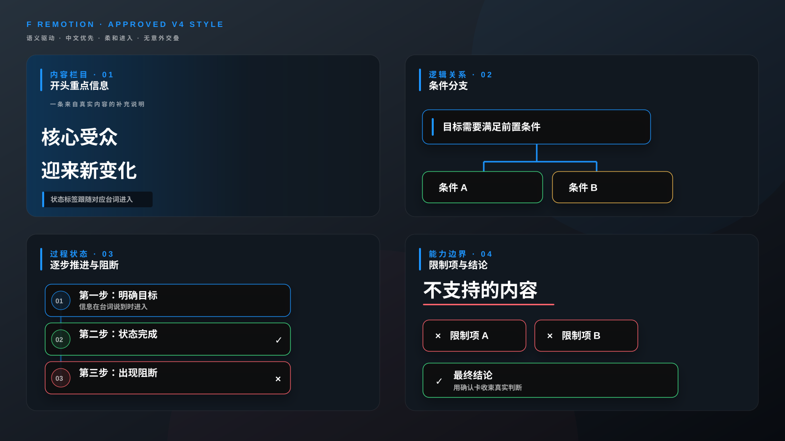

# f-remotion

一个面向中文口播、教程和知识视频的 Remotion 画中动效 Skill。

它以内置 V4 作为稳定视觉基因：透明根画布、中文信息层级、蓝绿红黄语义色、局部细描边深色卡片、柔和帧动画，以及按完整叙事任务组织且不交叠的时间轴。V4 不是封闭模板，Skill 会根据台词关系选择、变通或创造新的 Remotion 表现方式。

## 特点

- 不需要额外提供参考视频，直接使用内置 V4 风格。
- 先判断一句台词是否需要动效，再在留白、复用、变通和新创之间选择。
- 大动效按完整叙事任务而非字幕条数或“每两句”分组，同一主锚点可以跨多句驻留并局部更新。
- 按重点、定义、顺序、因果、对比、并列、边界、状态变化和数据等关系匹配表现方式。
- 内置整词级联、状态替换、阶段轨道、实体标识行、一次性确认、真实数字增长、区间计数和证据图表等可选能力，但不会机械调用。
- 场景根节点不添加全屏暗部渐变或语义调色层；深色表面只贴合局部文字、实体或图表组件。
- 现有场景不匹配时，可从语义关系和空间隐喻出发编写新的 Remotion 组件，同时维持 V4 质感。
- 能从后续参考片中提炼可迁移能力，并区分话题内容、作者素材和镜头氛围；不会为了模仿而硬加组件。
- 不为“科技感”机械添加大英文、扫描线、进度条、网格或假数据。
- SRT 默认只用于语义和帧时间轴；除非用户明确要求，否则不会生成字幕层。
- 自动识别用户已插入的截图、录屏、B-roll 和画中画，并将其完整区间设为禁加动效区。
- 包含 SRT 到 Remotion 帧号的转换工具。
- 包含可直接复制到项目中的 Remotion 动效原语。
- 包含关键帧、连续预览和全片解码验收流程。



## 安装

将 [`skills/f-remotion`](skills/f-remotion) 目录复制到本机 Codex Skills 目录：

```text
~/.codex/skills/f-remotion
```

重新打开任务后即可使用：

```text
使用 $f-remotion。
```

正常项目只需要提供目标视频和对应字幕/SRT。

## 目录

```text
skills/f-remotion/
├── SKILL.md
├── HANDOFF.md
├── agents/openai.yaml
├── assets/
│   ├── SemanticMotionPrimitives.tsx
│   ├── style-board.svg
│   └── approved-v4-source/
├── references/
│   ├── semantic-matching.md
│   ├── motion-library.md
│   └── ...
└── scripts/srt_to_timeline.py
```

`approved-v4-source` 是风格实现范例，其中的示例文案和固定时间点不应复制到新项目；新视频的场景数量、内容和时间必须由自身叙事任务与台词锚点决定。

## SRT 时间轴工具

```console
python skills/f-remotion/scripts/srt_to_timeline.py input.srt --fps 60 --format markdown
```

## License

[MIT](LICENSE)
